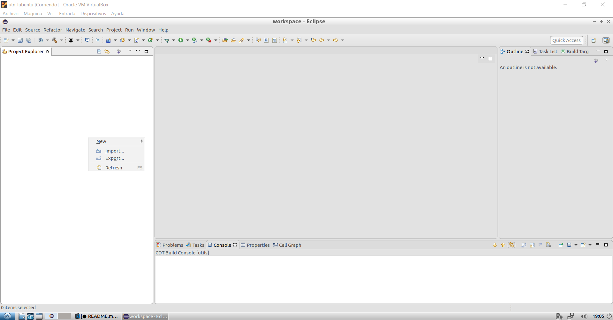
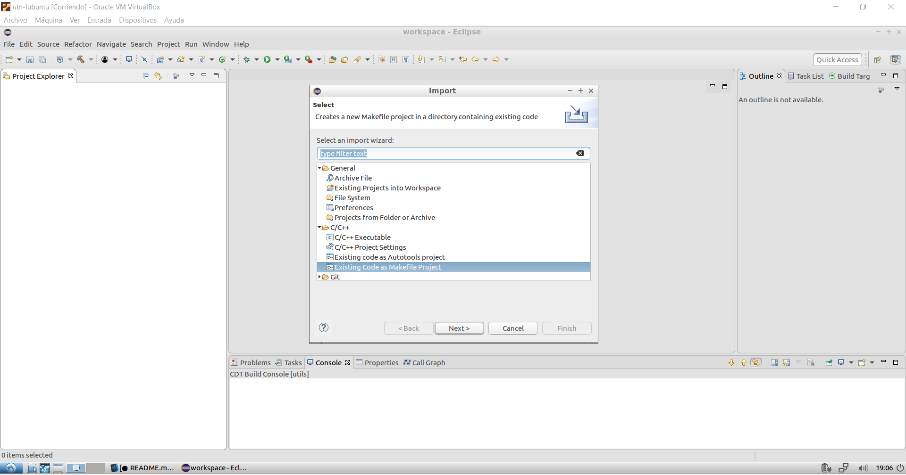
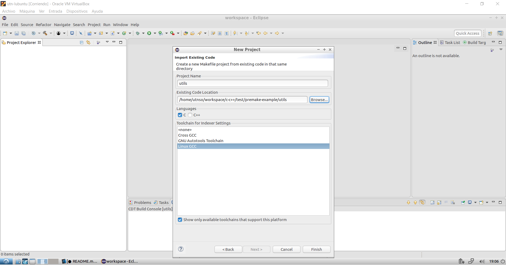
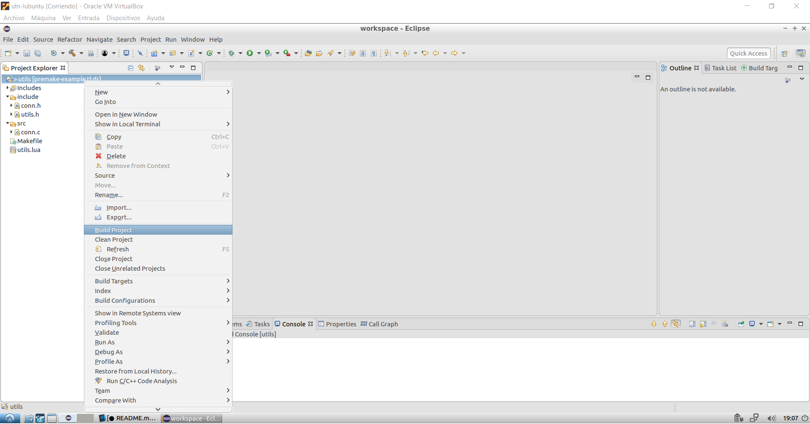
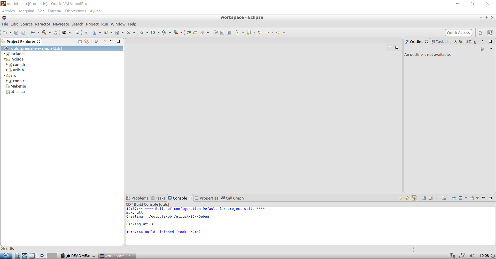

# Premake Example

Este repositorio pretende mostrar cómo configurar proyectos de C usando Premake. El tutorial está orientado para los alumnos que cursen la asignatura **Sistemas Operativos** en la **UTN FRBA**. Aunque también puede ser útil para cualquier persona que quiera configurar sus proyectos de C/C++ con Premake.

## ¿Que es Premake?
Premake es un generador de proyectos. Esto quiere decir que cuando creamos un proyecto de C/C++, configuramos nuestro workspace usando scripts de Premake, generando así el proyecto para el entorno o IDE que usemos. Actualmente, Premake soporta los siguientes entornos:

* Makefiles.
* Visual Studio (en casi todas sus versiones).
* codelite.
* xcode4.

Es decir, Premake nos permite desligarnos del entorno de trabajo que usemos (lo cual es muy útil para proyectos multiplataforma).

Sin embargo, por más que no estemos realizando un proyecto multiplataforma, podemos seguir aprovechando los beneficios de usar Premake. Sobre todo a la hora de comparar/escribir scripts de Makefiles vs escribir scripts de Premake. Los scripts de Premake son bastante simples, pero muy configurables.

## Configurando el workspace
Para ver cómo sería una configuración estándar de un workspace usando Premake, vamos a realizar un mini-proyecto en linux. La distribución de linux que emplearemos es el mismo que otorga la catedra de Sistemas Operativos de la UTN. La podés encontrar en [esta pagina](https://www.utnso.com.ar/recursos/máquinas-virtuales/).

El código de ejemplo, que vamos a estar usando, está disponible en este mismo repositorio. Existe un branch llamado _tutorial_ en el que está el proyecto sin ningún script de Premake para el que quiera descargar el proyecto en limpio y crear sus propios scripts de Premake.

Antes de comenzar a describir el workspace, no está de más aclarar que en este tutorial:
- No se muestran todas las características ni reglas disponibles en Premake. En caso de que quieran interiorizar más sobre Premake, el repo del mismo tiene una excelente [wiki](https://github.com/premake/premake-core/wiki) en la que se detallan todas sus reglas y características.
- En la página de Premake no hay binarios del programa para máquinas de 32 bits (que es la arquitectura de la máquina virtual ofrecida por la cátedra). Pero en este repo, dentro de la carpeta `premake/x86`, se encuentra el binario compilado para 32 bits. Esto les permite que, simplemente, se puedan bajar el repositorio y copiarse el binario para empezar a usar el Premake.

Con el prefacio concluido, comenzamos describiendo un poco el workspace.

La estructura del workspace es la siguiente:

```
    workspace
        |
        |__ client
        |      |__src
        |          |__ client.c
        |
        |__ server
        |      |__src
        |          |__ server.c
        |
        |__ utils
        |      |__include
        |      |    |__ conn.h
        |      |    |__ utils.h
        |      |
        |      |__src
        |          |__ conn.c
        |
        |__ premake
               |__ x86
                    |_ premake5

```

Dentro tenemos tres proyectos distintos. Cada uno representa un ejecutable o librería distinta. En nuestro caso, `client` y `server` son dos ejecutables y `utils` es una librería (en nuestro caso una librería estática).

El proyecto `server` es un servidor super simple que lo único que hace es recibir mensajes de algún cliente, envía una respuesta `"Hello From Server"`, imprime por pantalla el mensaje que recibió del cliente, cierra la conexión con dicho cliente y queda a la espera de otro cliente.

El proyecto `client` es un programa que solamente envía un mensaje `"Hello From Client"` al servidor, recibe la respuesta del servidor, imprime por pantalla el mensaje del servidor y finaliza cerrando la conexión.

Por último, `utils` posee algunas estructuras y funciones axuliares para poder simplificar la conexión y el envío de mensajes a los clientes.

No está de más aclarar que es posible expandir este proyecto, pero empleamos un volumen reducido para los fines del presente tutorial.

Ahora que ya tenemos el proyecto, empecemos a escribir los scripts necesarios.

### Scripts
Vamos a crear un script llamado `premake5.lua` en el directorio principal del workspace y abrirlo con cualquier editor de texto:

`touch premake5.lua`

Los scripts de Premake se pueden dividir en 2 partes:
- Una en la que configuramos las opciónes del workspace.
- Otra en donde configuramos cada uno de los proyectos.

Comencemos por configurar el workspace:

```lua
workspace "premake-example"
    configurations { "Debug", "Release" }
    architecture "x86"
```

Veamos qué hacen cada una de estas `reglas`:
* `workspace`: indica el nombre del workspace. En este caso, vamos a colocarle "premake-example" pero pueden colocar el nombre que más se adecúe a su proyecto.
* `configurations`: indicamos qué configuraciones tendrán cada uno de los proyectos dentro del workspace. Dependiendo bajo qué configuración estemos compilando, podemos establecer o no distintos flags de compilación. Por ejemplo, algo muy comun es que para compilaciones en **Debug** tengamos activados varios flags de compilación que nos permiten debuggear nuestros programas (como por ejemplo, la opción -g3 de gcc), mientras que en compilaciones en **Release** se suelen activar todos los flags para optimizar el código. Pero cada uno es libre de colocar y nombrar las configuraciones que desee.
* `architecture`: indica la arquitectura de la máquina en la que se va a compilar. Como en nuestro caso vamos a estar empleando la máquina virtual de la catedra de **Sistemas Operativos** (las cuales poseen linux de 32 bits), setteamos la arquitectura a x86. En caso de que se quiera compilar en un sistema de 64 bits, se deberá cambiar a x86_64. Veremos, en la posteridad, una forma para soportar cualquiera de estas dos arquitecturas sin tener que reescribir el script.

Estas son las reglas básicas que se necesitan para configurar nuestro workspace. Obviamente, se pueden especificar más reglas, pero las mencionadas hasta el momento nos bastan y sobran para la mayoría de los casos.

Ahora que hemos configurado el workspace, comencemos por configurar los proyectos. Empecemos por el proyecto `utils`.

Vamos a listar las primeras reglas:

```lua
project "utils"
    kind "StaticLib"
    language "C"
    cdialect "GNU11"
```

Del mismos modo que el _workspace_, veamos qué hacen estas reglas:
* `project`: indica el nombre del proyecto.
* `kind`: indica el tipo de proyecto. En nuestro caso, estamos creando una librería estática. Las opciones disponibles para esta regla son: **StaticLib**, **SharedLib** y **ConsoleApp**.
* `language`: indica el lenguaje que se va a usar. En nuestro caso, C.
* `cdialect`: indica el estandar que emplearemos. En nuestro caso vamos a usar el estándar 11 con las extensiones de GNU.

Luego de estas reglas, setteemos los directorios donde vamos a colocar los binarios:

```lua
    targetdir "%{wks.location}/output/bin/%{prj.name}%{cfg.architecture}/%{cfg.buildcfg}"
    objdir "%{wks.location}/output/obj/%{prj.name}%{cfg.architecture}/%{cfg.buildcfg}"
```

* `targetdir`: settea el directorio donde se va a colocar el binario o la librería resultante del proceso de compilación.
* `objdir`: settea el directorio donde se van a colocar los archivos intermedios, como archivos .o.

En estas reglas, estamos usando una serie de tokens que nos permiten acceder a algunos datos del proyecto. Hay una lista completa del significado de estos tokens en [esta página](https://github.com/premake/premake-core/wiki/Tokens). Por el momento, veamos qué hacen los tokens que empleamos:

* `%{wks.location}`: contiene el directorio del workspace.
* `%{prj.name}`: contiene el nombre del proyecto.
* `%{cfg.architecture}`: contiene la arquitectura que se setteó para el workspace actual.
* `%{cfg.buildcfg}`: se reemplaza por la configuración activa del proyecto. Esto quiere decir que, si compilamos en **Debug**, este token se reemplaza por **Debug**.

Las siguientes reglas establecen los directorios de inclusión y los archivos que utilizaremos para compilar el proyecto:

```lua
    includedirs {
        "%{wks.location}/utils/include"
    }

    files {
        "%{wks.location}/utils/include/utils.h",
        "%{wks.location}/utils/include/conn.h",
        "%{wks.location}/utils/src/conn.c",
    }
```

* `includedirs`: lista de directorios donde se buscarán los archivos .h
* `files`: lista de archivos utilizados para compilar.

Si bien este proyecto posee pocos archivos, sería poco práctico estar enlistando cada uno de los archivos que queramos compilar. Por suerte, se pueden utilizar _wildcards_ para especificar cualquier archivo. Por ejemplo:

```lua
    files {
        "%{wks.location}/utils/include/*.h",
        "%{wks.location}/utils/src/*.c",
    }
```

Esto incluirá automáticamente cualquier archivo terminado con .h en el directorio _include_ y .c en el directorio _src_. Existe también otra forma de agregar cualquier archivo dentro del directorio especificado y en los subdirectorios:

```lua
    files {
        "%{wks.location}/utils/include/**.h",
        "%{wks.location}/utils/src/**.c",
    }
```

Con esto, agregamos cualquier archivo .h que se encuentre en el directorio _include_ y cualquier otro subdirectorio dentro del _include_. Esto corresponde también en forma análoga para el _src_.

Finalmente, especificamos distintas opciones dependiendo de la configuración en la que se esté compilando:

```lua
    filter "configurations:Debug"
        symbols "on"
        warnings "extra"
        buildoptions "-g3"

    filter "configurations:Release"
        optimize "speed"
        warnings "extra"
        fatalwarnings "all"
```

* `filter`: regla que nos permite aplicar determinadas reglas dependiendo del filtro especificado. En nuestro caso, vamos a agregar reglas dependiendo de la configuración que se esté usando.
* `symbol`: especifica si se incluirán los simbolos de depuración en el binario.
* `warnings`: especifica el nivel de warnings. "extra" settea el nivel de warnings en el máximo nivel.
* `buildoptions`: permite especificar flags de compilación para el compilador. Vamos a agergar el flag -g3 para poder depurar macros.
* `optimize`: settea el nivel de optimización.
* `fatalwarnings`: especifica qué warnings se tratan como errores. En este caso, todos los warnings serán tratados como errores.

Estas serían todas las reglas necesarias para el proyecto `utils`. La configuración completa quedaría de la siguiente forma:

```lua
project "utils"
    kind "StaticLib"
    language "C"
    cdialect "GNU11"

    targetdir "%{wks.location}/outputs/bin/%{prj.name}/%{cfg.architecture}/${cfg.buildcfg}"
    objdir    "%{wks.location}/outputs/obj/%{prj.name}/%{cfg.architecture}/${cfg.buildcfg}"

    includedirs {
        "%{wks.location}/utils/include"
    }

    files {
        "%{wks.location}/utils/include/**.h",
        "%{wks.location}/utils/src/**.c",
    }

    filter "configurations:Debug"
        symbols "on"
        warnings "extra"
        buildoptions "-g3"

    filter "configurations:Release"
        optimize "speed"
        warnings "extra"
        fatalwarnings "all"
```

La ventaja que tenemos ahora es que, salvo para algunas reglas, podremos copiar y pegar la misma configuración que usamos para `utils` en `server` y `client`:

```lua
project "server"
    kind "ConsoleApp"
    language "C"
    cdialect "GNU11"

    targetdir "%{wks.location}/outputs/bin/%{prj.name}/%{cfg.architecture}/${cfg.buildcfg}"
    objdir    "%{wks.location}/outputs/obj/%{prj.name}/%{cfg.architecture}/${cfg.buildcfg}"

    includedirs {
        "%{wks.location}/utils/include"
    }

    files {
        "%{wks.location}/server/src/**.c"
    }

    links {
        "utils"
    }

    filter "configurations:Debug"
        symbols "on"
        warnings "extra"
        buildoptions "-g3"

    filter "configurations:Release"
        optimize "speed"
        warnings "extra"
        fatalwarnings "all"

project "client"
    kind "ConsoleApp"
    language "C"
    cdialect "GNU11"

    targetdir "%{wks.location}/outputs/bin/%{prj.name}/%{cfg.architecture}/${cfg.buildcfg}"
    objdir    "%{wks.location}/outputs/obj/%{prj.name}/%{cfg.architecture}/${cfg.buildcfg}"

    includedirs {
        "%{wks.location}/utils/include"
    }

    files {
        "%{wks.location}/client/src/**.c"
    }

    links {
        "utils"
    }

    filter "configurations:Debug"
        symbols "on"
        warnings "extra"
        buildoptions "-g3"

    filter "configurations:Release"
        optimize "speed"
        warnings "extra"
        fatalwarnings "all"
```

Los cambios que hicimos fueron:
* En `project`, colocamos el nombre del proyecto correspondiente.
* `kind` es setteado a _ConsoleApp_ tanto en `server` como en `client`.
* En _files_, especificamos la ruta correspondiente donde buscamos los archivos a compilar para cada proyecto.

Además, agregamos una regla más:
* `link`: especificamos qué librerías vincular al proyecto. En caso de que la librería sea `libxxx.a` o `libxxx.so` se pueden obviar tanto los prefijos `lib` como la extensión. Y en caso de que se esté linkeando con algún proyecto dentro del mismo workspace, bastará con poner solamente el nombre del proyecto. En nuestro caso: `utils`.

El script completo debería quedar de la siguiente forma:

```lua
workspace "premake-example"
    configurations { "Debug", "Release" }
    architecture "x86"

project "utils"
    kind "StaticLib"
    language "C"
    cdialect "GNU11"

    targetdir "%{wks.location}/outputs/bin/%{prj.name}/%{cfg.architecture}/${cfg.buildcfg}"
    objdir    "%{wks.location}/outputs/obj/%{prj.name}/%{cfg.architecture}/${cfg.buildcfg}"

    includedirs {
        "%{wks.location}/utils/include"
    }

    files {
        "%{wks.location}/utils/include/**.h",
        "%{wks.location}/utils/src/**.c",
    }

    filter "configurations:Debug"
        symbols "on"
        warnings "extra"
        buildoptions "-g3"

    filter "configurations:Release"
        optimize "speed"
        warnings "extra"
        fatalwarnings "all"

project "server"
    kind "ConsoleApp"
    language "C"
    cdialect "GNU11"

    targetdir "%{wks.location}/outputs/bin/%{prj.name}/%{cfg.architecture}/${cfg.buildcfg}"
    objdir    "%{wks.location}/outputs/obj/%{prj.name}/%{cfg.architecture}/${cfg.buildcfg}"

    includedirs {
        "%{wks.location}/utils/include"
    }

    files {
        "%{wks.location}/server/src/**.c"
    }

    links {
        "utils"
    }

    filter "configurations:Debug"
        symbols "on"
        warnings "extra"
        buildoptions "-g3"

    filter "configurations:Release"
        optimize "speed"
        warnings "extra"
        fatalwarnings "all"

project "client"
    kind "ConsoleApp"
    language "C"
    cdialect "GNU11"

    targetdir "%{wks.location}/outputs/bin/%{prj.name}/%{cfg.architecture}/${cfg.buildcfg}"
    objdir    "%{wks.location}/outputs/obj/%{prj.name}/%{cfg.architecture}/${cfg.buildcfg}"

    includedirs {
        "%{wks.location}/utils/include"
    }

    files {
        "%{wks.location}/client/src/**.c"
    }

    links {
        "utils"
    }

    filter "configurations:Debug"
        symbols "on"
        warnings "extra"
        buildoptions "-g3"

    filter "configurations:Release"
        optimize "speed"
        warnings "extra"
        fatalwarnings "all"
```

## Compilación

Ahora que tenemos listo nuestro script de premake, ejecutemos premake. Parado en el directorio principal del workspace hacemos:

`premake/x86/premake5 gmake2`

Esto generará los makefiles necesarios para compilar los distintos proyectos. El directorio se debería ver de la siguiente forma:

```
    workspace
        |
        |__ client
        |      |__src
        |          |__ client.c
        |
        |__ server
        |      |__src
        |          |__ server.c
        |
        |__ utils
        |      |__include
        |      |    |__ conn.h
        |      |    |__ utils.h
        |      |
        |      |__src
        |          |__ conn.c
        |
        |__ premake
        |      |__ x86
        |           |_ premake5
        |
        |__ Makefile
        |
        |__ client.make
        |
        |__ server.make
        |
        |__ utils.make
```

De ahora en más, simplemente ejecutamos make para compilar los proyectos:

`make`

Por defecto, el proyecto se compila en **Debug**. Si quisiéramos ejecutar en **Release**:

`make config=release`

Al compilarlo, se van a generar los binarios en los directorios que especificamos en las reglas `targetdir` y `objdir`. El directorio (dependiendo de la configuración en la que compilemos) podría quedar de la siguiente manera:

```
    workspace
        |
        |__ outputs
        |      |__ bin
        |      |    |__ client
        |      |    |      |__ x86
        |      |    |           |__ Debug
        |      |    |           |     |__ client
        |      |    |           |
        |      |    |           |__ Release
        |      |    |                 |__ client
        |      |    |
        |      |    |__ server
        |      |    |      |__ x86
        |      |    |           |__ Debug
        |      |    |           |     |__ server
        |      |    |           |
        |      |    |           |__ Release
        |      |    |                 |__ server
        |      |    |
        |      |    |__ utils
        |      |           |__ x86
        |      |                |__ Debug
        |      |                |     |__ libutils.a
        |      |                |
        |      |                |__ Release
        |      |                      |__ libutils.a
        |      |    
        |      |
        |      |__ obj
        |           |__ client
        |           |      |__ x86
        |           |           |__ Debug
        |           |           |     |__ main.d
        |           |           |     |
        |           |           |     |__ main.o
        |           |           |
        |           |           |__ Release
        |           |                 |__ main.d
        |           |                 |
        |           |                 |__ main.o
        |           |
        |           |__ server
        |           |      |__ x86
        |           |           |__ Debug
        |           |           |     |__ main.d
        |           |           |     |
        |           |           |     |__ main.o
        |           |           |
        |           |           |__ Release
        |           |                 |__ main.d
        |           |                 |
        |           |                 |__ main.o
        |           |
        |           |__ utils
        |                  |__ x86
        |                       |__ Debug
        |                       |     |__ conn.d
        |                       |     |
        |                       |     |__ conn.o
        |                       |
        |                       |__ Release
        |                             |__ conn.d
        |                             |
        |                             |__ conn.o
        |
        |__ client
        |      |__src
        |          |__ client.c
        |
        |__ server
        |      |__src
        |          |__ server.c
        |
        |__ utils
        |      |__include
        |      |    |__ conn.h
        |      |    |__ utils.h
        |      |
        |      |__src
        |          |__ conn.c
        |
        |__ premake
        |      |__ x86
        |           |_ premake5
        |
        |__ Makefile
        |
        |__ client.make
        |
        |__ server.make
        |
        |__ utils.make
```

Y eso sería todo. Para probar que todo esté funcionando, simplemente ejecutamos los programas que se encuentran en los directorios de salida.

**Aclaración**: dado que _Premake_ genera los Makefiles, cada vez que se agregue un archivo nuevo dentro de algun proyecto, se deberá ejecutar _Premake_ nuevamente para que el nuevo archivo sea incluido dentro del _Makefile_.

## Usando Eclipse
Si bien este aspecto no tiene mucho que ver, en específico, con _Premake_, vamos a ver cómo hacer para usar _Eclipse_ junto con _Premake_. Básicamente importamos los proyectos como **proyectos de Makefile** de la siguiente manera:

* Dentro del IDE, hacemos click derecho sobre el workspace > Importar:


* Luego seleccionamos en **C/C++ > Existing Code as Makefile Project**:


* Buscamos el directorio dentro del workspace -de uno de nuestros proyectos-. Para el caso del tutorial, vamos a seleccionar el del `utils`. En lenguaje seleccionamos `C` y en los _ToolChain_ seleccionamos `Linux GCC`:


* Una vez hecho esto, ya deberíamos ver nuestro proyecto en el workspace. Para probar que todo haya salido correctamente, hacemos click derecho sobre el proyecto y luego en **Build Project**:


* Esto nos deberia mostrar los pasos de compilación como lo indica la siguiente imagen. Si no se llegaran a ver, pueden intentar hacer click derecho sobre el proyecto > **Clear Project** y luego buildear de nuevo siguiendo -el paso anterior-:


Y listo. Debemos repetir estos pasos de la misma manera para los otros tres proyectos.
**Aclaración**: de la misma manera que hay que correr _Premake_ cuando agregamos nuevos archivos al proyecto con los _Makefiles_, también debemos hacerlo cuando agregamos archivos desde Eclipse (ya que Eclipse lo único que hace, en esencia, es correr los _Makefiles_).

## TL;DR

Con todo lo anterior, ya estamos en condiciones de settear cualquier workspace o proyecto de C usando _Premake_. Lo que sigue a continuación son algunos tópicos extras que nos pueden ser de utilidad para organizar mejor nuestros scripts.

## Uso de variables

Como _Premake_ esta escrito en _lua_, nada nos impide poder usar todas las características del lenguaje. No nos explayaremos en demasia con temas muy especificos sobre lenguaje, pero una de las cosas de las que sí podemos sacar provecho son las `variables`.

Anteriormente, setteamos los directorios de salida como:

`<workspace>/outputs/bin/<project-name>/<architecture>/<configuration>`

Ahora, imaginemos que nosotros quisiéramos cambiar la ruta en dónde colocar nuestros binarios más al estilo Eclipse:

`<workspace>/<project-name>/<configuration>`

Deberíamos ir recorriendo cada proyecto e ir cambiando cada uno de los directorios. Una alternativa seria settear alguna variable en la que podamos colocar los directorios comunes a todos los proyectos. Por ejemplo:

```lua
workspace "premake-example"
    configurations { "Debug", "Release" }
    architecture "x86"

    --Common Locations--
    --------------------

    CommonLocations = { }
    CommonLocations["TargetDir"] = "%{wks.location}/outputs/bin/%{prj.name}/%{cfg.architecture}/%{cfg.buildcfg}"
    CommonLocations["ObjDir"]    = "%{wks.location}/outputs/obj/%{prj.name}/%{cfg.architecture}/%{cfg.buildcfg}"

    .
    .
    .

```

Luego, podríamos acceder a esta variable de manera similar a como lo hacemos con los _tokens_, predefinidos de _Premake_:

```lua
project "utils"
    kind "StaticLib"
    language "C"
    cdialect "GNU11"

    targetdir "%{CommonLocations.TargetDir}"
    objdir    "%{CommonLocations.ObjDir}"
    .
    .
    .

project "server"
    kind "ConsoleApp"
    language "C"
    cdialect "GNU11"

    targetdir "%{CommonLocations.TargetDir}"
    objdir    "%{CommonLocations.ObjDir}"
    .
    .
    .

project "client"
    kind "ConsoleApp"
    language "C"
    cdialect "GNU11"

    targetdir "%{CommonLocations.TargetDir}"
    objdir    "%{CommonLocations.ObjDir}"
    .
    .
    .

```

De esta forma, si en el futuro quisiéamos cambiar el directorio de salida de nuestros binarios, simplemente modificamos la variable que contiene los directorios de salida:

```lua
workspace "premake-example"
    configurations { "Debug", "Release" }
    architecture "x86"

    --Common Locations--
    --------------------

    CommonLocations = { }
    CommonLocations["TargetDir"] = "%{wks.location}/%{prj.name}/%{cfg.buildcfg}"
    CommonLocations["ObjDir"]    = "%{wks.location}/%{prj.name}/%{cfg.buildcfg}"

    .
    .
    .
```

## Multiples scripts

Estuvimos hasta ahora colocando todas las reglas para cada proyecto en un único script. Pero, ¿no sería más fácil si pudiéramos separar cada configuración en diferentes scripts?

Esto se puede lograr mediante: el agregado de tres scripts más, aparte del script principal, uno en el directorio principal de cada proyecto:

```
    workspace
        |
        |__ client
        |      |__src
        |      |   |__ client.c
        |      |
        |      |__ client.lua
        |
        |__ server
        |      |__src
        |      |   |__ server.c
        |      |
        |      |__ server.lua
        |
        |__ utils
        |      |__include
        |      |    |__ conn.h
        |      |    |__ utils.h
        |      |
        |      |__src
        |      |   |__ conn.c
        |      |
        |      |__ utils.lua
        |
        |__ premake
               |__ x86
                    |_ premake5

```

En estos scripts vamos a copiar la configuración de cada uno de los proyectos:

### En `utils.lua`:
```lua
project "utils"
    kind "StaticLib"
    language "C"
    cdialect "GNU11"

    targetdir "%{wks.location}/outputs/bin/%{prj.name}/%{cfg.architecture}/${cfg.buildcfg}"
    objdir    "%{wks.location}/outputs/obj/%{prj.name}/%{cfg.architecture}/${cfg.buildcfg}"

    includedirs {
        "%{wks.location}/utils/include"
    }

    files {
        "%{wks.location}/utils/include/**.h",
        "%{wks.location}/utils/src/**.c",
    }

    filter "configurations:Debug"
        symbols "on"
        warnings "extra"
        buildoptions "-g3"

    filter "configurations:Release"
        optimize "speed"
        warnings "extra"
        fatalwarnings "all"
```

### En `server.lua`:
```lua
project "server"
    kind "ConsoleApp"
    language "C"
    cdialect "GNU11"

    targetdir "%{wks.location}/outputs/bin/%{prj.name}/%{cfg.architecture}/${cfg.buildcfg}"
    objdir    "%{wks.location}/outputs/obj/%{prj.name}/%{cfg.architecture}/${cfg.buildcfg}"

    includedirs {
        "%{wks.location}/utils/include"
    }

    files {
        "%{wks.location}/server/src/**.c"
    }

    links {
        "utils"
    }

    filter "configurations:Debug"
        symbols "on"
        warnings "extra"
        buildoptions "-g3"

    filter "configurations:Release"
        optimize "speed"
        warnings "extra"
        fatalwarnings "all"
```

### En `client.lua`:
```lua
project "client"
    kind "ConsoleApp"
    language "C"
    cdialect "GNU11"

    targetdir "%{wks.location}/outputs/bin/%{prj.name}/%{cfg.architecture}/${cfg.buildcfg}"
    objdir    "%{wks.location}/outputs/obj/%{prj.name}/%{cfg.architecture}/${cfg.buildcfg}"

    includedirs {
        "%{wks.location}/utils/include"
    }

    files {
        "%{wks.location}/client/src/**.c"
    }

    links {
        "utils"
    }

    filter "configurations:Debug"
        symbols "on"
        warnings "extra"
        buildoptions "-g3"

    filter "configurations:Release"
        optimize "speed"
        warnings "extra"
        fatalwarnings "all"
```

Y en nuestro script principal, incluímos estos scripts de la siguiente forma:

### En `premake5.lua`:
```lua
workspace "premake-example"
    configurations { "Debug", "Release" }
    architecture "x86"

    --Common Locations--
    --------------------

    CommonLocations = { }
    CommonLocations["TargetDir"] = "%{wks.location}/outputs/bin/%{prj.name}/%{cfg.architecture}/%{cfg.buildcfg}"
    CommonLocations["ObjDir"]    = "%{wks.location}/outputs/obj/%{prj.name}/%{cfg.architecture}/%{cfg.buildcfg}"

    include("utils/utils.lua")
    include("server/server.lua")
    include("client/client.lua")
```

De esta manera no tenemos la configuración de todos los proyectos metidos en un solo script gigante. Nos permite buscar las configuraciones particulares de un proyecto rápidamente.

## Creando nuevas opciones

_Premake_ también permite crear opciones personalizadas que podemos pasarle a la hora de ejecutar los scripts. En nuestro caso, lo que queremos hacer es decirle a _premake_ bajo qué arquitectura estamos compilando los proyectos. De esta manera, no tenemos que reescribir el script para compilar en 32 bits o en 64 bits. Esto se logra de la siguiente manera:

### En `premake5.lua`:
```lua
newoption {
    trigger = "arch",
    description = "Set the current target architecture",
    default = "x86",
    allowed = {
        { "x86", "32 bit target architecture" },
        { "x86_64", "64 bit target architecture" },
    }
}

workspace "premake-example"
    configurations { "Debug", "Release" }
    architecture (_OPTIONS["arch"])
    .
    .
    .

```

`newoption` nos permite crear opciones extras que podemos pasarle a _Premake_ cuando lo invocamos:

* `trigger`: el nombre de la opción. Esta se debe especificar luego cuando se ejecuta _premake_ como `--<option>`. En nuestro caso: `--arch`
* `description`: una descripción del flag. Esta puede aparecer luego si hacemos: `premake5 --help`.
* `default`: valor por defecto en caso de que no hayamos setteado la opción.
* `allowed`: todas las opciones disponibles. Estas se pueden especificar a la hora de ejecutar _Premake_ haciendo: `premake5 --<option>=<value>`. Un ejemplo sería: `premake5 --arch=x86_64`.

Una vez creada esta nueva opción, podemos settear la arquitectura a la que queremos compilar haciendo:

`premake/x86/premake5 --arch=x86 gmake2` | `premake/x86_64/premake5 --arch=x86_64 gmake2`